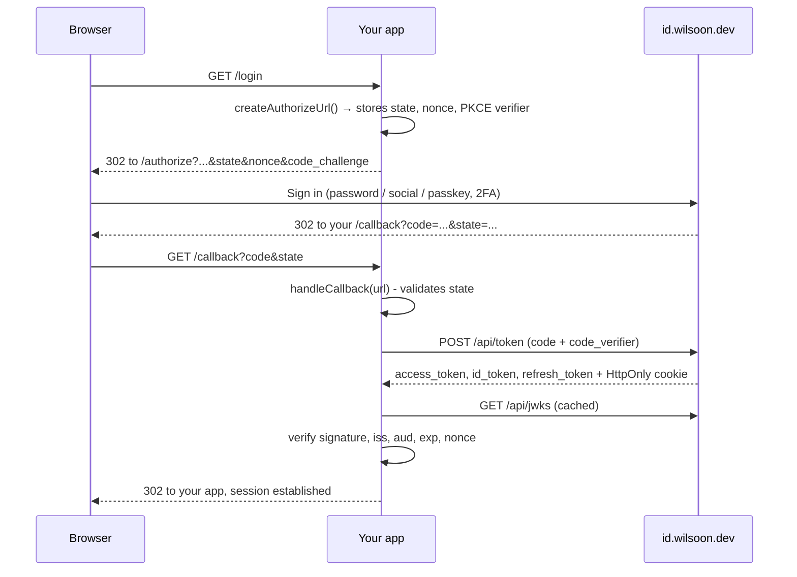

# Integrating an application - guide for SDK v2.0

For wiring an application up to an OIDC provider with `@wilsoon/auth-core`, `@wilsoon/auth-react` or `@wilsoon/auth-next`.

Read [Is the flow different now?](#is-the-flow-different-now) first if you already have a working 1.x integration, then jump to the recipe for your stack.

---

## Contents

- [Is the flow different now?](#is-the-flow-different-now)
- [The one rule](#the-one-rule)
- [Two session models - pick yours first](#two-session-models--pick-yours-first)
- [Setup](#setup)
- [Recipe 1 - Next.js App Router](#recipe-1--nextjs-app-router)
- [Recipe 2 - React SPA](#recipe-2--react-spa)
- [Recipe 3 - Any other server framework](#recipe-3--any-other-server-framework-astro-express-hono-sveltekit)
- [Recipe 4 - API / resource server](#recipe-4--api--resource-server)
- [Recipe 5 - Astro on Cloudflare Workers](#recipe-5--astro-on-cloudflare-workers)
- [Do I have to change every `user.role` check?](#do-i-have-to-change-every-userrole-check)
- [Authorization: role, amr, step-up](#authorization-role-amr-step-up)
- [Session revocation](#session-revocation)
- [Logout](#logout)
- [Troubleshooting by error code](#troubleshooting-by-error-code)
- [Checklist before you ship](#checklist-before-you-ship)

---

## Is the flow different now?

**The protocol flow is identical. The SDK calls you make at three of the steps changed, and
one new parameter is sent.**

Same as before: authorization code + PKCE, the same endpoints, the same redirect to
`/authorize`, the same `?code=&state=` callback, the same `/api/token` exchange, the same
`/api/logout` for RP-initiated logout, the same HttpOnly `wilsoon_id_tokens` cookie set by
the provider. Nothing about your registered client, redirect URIs or secrets changes, and an
in-flight login started on 1.x still completes on 2.0.

| Step                         | 1.x                                                             | 2.0                                                              | Protocol change?                            |
| ---------------------------- | --------------------------------------------------------------- | ---------------------------------------------------------------- | ------------------------------------------- |
| Build the authorize URL      | `createAuthorizeUrl()`, you store `state` + verifier            | `createAuthorizeUrl()` stores `state`, `nonce`, verifier for you | Adds `nonce` (already supported by the IdP) |
| Redirect to `/authorize`     | same                                                            | same                                                             | No                                          |
| Callback `?code=&state=`     | `validateState()` → `exchangeCodeForToken()` → `parseIdToken()` | **`handleCallback(url)`** does all of it, and verifies the token | No                                          |
| Read the session server-side | `getSession()` → decoded claims                                 | `getSession()` → **verified** claims                             | No                                          |
| Gate on `role` / `amr`       | decoded from the ID token (forgeable) or missing from userinfo  | `verifyIdToken()` / `getSession()` / `requireSession()`          | No                                          |
| Refresh                      | `refreshAccessToken()`, you re-save                             | `refreshAccessToken()`, single-flight, saves rotated tokens      | No                                          |
| Logout                       | `getLogoutUrl()` → redirect                                     | unchanged                                                        | No                                          |

So: **same conversation with the IdP, different (and much shorter) code on your side.**

The full flow, for reference:



---

## The one rule

**Authorize only on a verified token.** In practice that means one of:

```ts
const user = await client.verifyIdToken(idToken); // any runtime
const { user } = await getSession(authConfig); // Next.js server
const user = await requireSession(authConfig, { roles: ["admin"] });
const claims = await client.verifyAccessToken(token, { audience: API_AUDIENCE }); // your API
```

Anything else is either display-only or forgeable:

| Source                                                | `role` / `amr` / `sessionVersion`  | Why                                                                        |
| ----------------------------------------------------- | ---------------------------------- | -------------------------------------------------------------------------- |
| `verifyIdToken()`, `getSession()`, `handleCallback()` | ✅ present and verified            | signature + `iss` + `aud` + `exp` + `nonce` checked against the IdP's JWKS |
| `getUser()`, `hydrateSession()`                       | ❌ not in the type                 | the userinfo endpoint returns profile claims only                          |
| `parseIdToken()`, `decodeIdTokenUnsafe()`             | ⚠️ present but unverified          | anyone can mint a JWT with `role: "admin"` and an empty signature          |
| `useAuth().user` in the browser                       | only when `user.verified === true` | and even then it is for rendering, not access control                      |

---

## Two session models - pick yours first

Everything else follows from this, so settle it before writing code.

### Model A - platform session (what `*.wilsoon.dev` uses)

One login serves every service. The identity provider writes a single HttpOnly
`wilsoon_id_tokens` cookie scoped to `.wilsoon.dev`, so `dash.wilsoon.dev` and
`go.wilsoon.dev` both receive it and neither prompts the user again.

The consequence that matters: **that cookie holds the tokens of whichever service most recently
completed a code exchange.** Each service is a separate client, so the ID token inside it is
addressed (`aud`) to that service alone - verifying it anywhere else fails, correctly, because
a token addressed to another party is exactly what token substitution looks like.

So in this model:

| Token in the shared cookie | Who may authorize on it             | Why                                          |
| -------------------------- | ----------------------------------- | -------------------------------------------- |
| `id_token`                 | only the service named in its `aud` | per-service audience; that's the point of it |
| `access_token`             | every first-party service           | addressed to the shared platform audience    |

Identity therefore comes from the **access token**, and `role` / `amr` / `session_version` come
from **introspection** - which is live, so a role change or a "sign out everywhere" is honoured
immediately rather than at token expiry. This is structurally what Google does across its own
properties: shared session cookie, authorization decided per service on the server.

```ts
// lib/auth-config.ts - a service in a shared-cookie platform
export const authConfig: AuthConfig = {
  clientId: process.env.WILSOON_CLIENT_ID!, // this service's own client
  clientSecret: process.env.WILSOON_CLIENT_SECRET!, // required: introspection is confidential
  issuer: "https://id.wilsoon.dev",
  redirectUri: "https://dash.wilsoon.dev/api/auth/callback",
  apiAudience: "https://api.wilsoon.dev", // required for the platform path
  platformSessionCacheSeconds: 10, // optional: one introspection per 10s
};
```

With `apiAudience` and `clientSecret` set, `getSession()` handles both cases on its own:

```ts
const { user } = await getSession(authConfig);
user.source; // 'id_token' right after this service's own callback,
// 'access_token' when the cookie came from a sibling service
```

Or directly, outside Next.js:

```ts
const user = await client.verifyPlatformSession(tokens.access_token);
```

Middleware only pays for introspection when it has to: with no `roles`/`amr` policy it verifies
the access token locally, and introspects only when a policy needs the live claims.

**The trade-off, stated plainly:** any service that can read that cookie can act as the user at
every other service. That is fine while every `*.wilsoon.dev` host is equally trusted and
operated by you. The day a lower-trust or third-party app gets a subdomain, move it to Model B -
give it its own host-only session cookie, and it will no longer be able to present the platform
token elsewhere.

Cross-service introspection requires the calling application to be marked `first_party` in the
provider's `applications` table. A third-party client can still only introspect tokens issued to
itself.

### Model B - per-application session (standard OIDC)

Each app keeps its own session cookie (host-only, its own name) and authorizes on its own ID
token. Single sign-on still works - the provider's own session cookie makes the second login
silent - but no app can present another's token. Use this for anything you don't fully control.

```ts
const { user } = await getSession(authConfig); // resolves via this app's own id_token
```

Nothing extra to configure; omit `apiAudience` and the platform path is simply never taken.

---

## Setup

```bash
npm install @wilsoon/auth-core                      # any runtime
npm install @wilsoon/auth-next @wilsoon/auth-react  # Next.js App Router
npm install @wilsoon/auth-react                     # React SPA
```

Requires Node.js 18+ (or a browser/edge runtime with Web Crypto).

One config object, shared everywhere:

```ts
// lib/auth-config.ts
import type { AuthConfig } from "@wilsoon/auth-core";

export const authConfig: AuthConfig = {
  clientId: process.env.WILSOON_CLIENT_ID!,
  issuer: "https://id.wilsoon.dev",
  redirectUri: `${process.env.APP_URL}/api/auth/callback`,
  scope: ["openid", "profile", "email"], // add 'offline_access' if you need refresh tokens

  // Server-side only. Never ship a secret to the browser.
  clientSecret: process.env.WILSOON_CLIENT_SECRET,

  // Only for an API verifying access tokens:
  apiAudience: "https://api.wilsoon.dev",
};
```

`redirectUri` must exactly match one of your registered redirect URIs.

---

## Recipe 1 - Next.js App Router

### Login and callback route handlers

```ts
// app/api/auth/login/route.ts
import { cookies } from "next/headers";
import { NextResponse } from "next/server";
import { AuthClient } from "@wilsoon/auth-core";
import { ServerCookieStorage } from "@wilsoon/auth-next";
import { authConfig } from "@/lib/auth-config";

export async function GET() {
  const client = new AuthClient(authConfig, new ServerCookieStorage(await cookies()));

  // Persists state, nonce and the PKCE verifier as HttpOnly cookies (10 min).
  // Next.js applies those cookie writes to whatever response this handler returns.
  const { url } = await client.createAuthorizeUrl();

  return NextResponse.redirect(url);
}
```

```ts
// app/api/auth/callback/route.ts
import { cookies } from "next/headers";
import { NextResponse } from "next/server";
import { AuthClient, AuthError } from "@wilsoon/auth-core";
import { ServerCookieStorage } from "@wilsoon/auth-next";
import { authConfig } from "@/lib/auth-config";

export async function GET(request: Request) {
  const client = new AuthClient(authConfig, new ServerCookieStorage(await cookies()));

  try {
    // Validates state, exchanges the code with its PKCE verifier, verifies the ID token
    // (signature, iss, aud, exp, nonce), then clears the transient cookies.
    const { user } = await client.handleCallback(request.url);

    console.log(`signed in: ${user?.id} (${user?.role})`);
    return NextResponse.redirect(new URL("/dashboard", request.url));
  } catch (error) {
    const code = error instanceof AuthError ? error.code : "UNKNOWN";
    return NextResponse.redirect(new URL(`/login?error=${code}`, request.url));
  }
}
```

The provider also sets its own HttpOnly `wilsoon_id_tokens` cookie on `.wilsoon.dev` during
the exchange. If your app is **not** on a `wilsoon.dev` subdomain, persist the tokens
yourself with `handleCallback(request.url, { persistTokens: true })` so `getSession()` has
something to read.

### Middleware

```ts
// middleware.ts
import { createAuthMiddleware } from "@wilsoon/auth-next";
import { authConfig } from "./lib/auth-config";

export const middleware = createAuthMiddleware({
  ...authConfig,
  loginPath: "/api/auth/login",
  unauthorizedPath: "/unauthorized",
  // verify: true by default - checks the ID token per request
  // roles: ['admin'],
  // amr: ['fido'],
});

export const config = { matcher: ["/dashboard/:path*", "/admin/:path*"] };
```

It verifies the session, refreshes an access token that is within 60s of expiry (writing the
rotated tokens back to the cookie), and clears the cookie rather than redirect-looping when a
session cannot be verified.

### Server Components and Route Handlers

```tsx
import { getSession, requireSession } from "@wilsoon/auth-next";
import { authConfig } from "@/lib/auth-config";

export default async function Page() {
  const { user } = await getSession(authConfig); // user is null unless verified
  if (!user) redirect("/api/auth/login");

  return (
    <p>
      Hello {user.name}, you are {user.role}.
    </p>
  );
}
```

```ts
// Guard clause style - throws instead of returning null.
const user = await requireSession(authConfig, { roles: ["admin"], amr: ["fido"] });
```

Verifying clients are cached per config, so the JWKS is fetched once per runtime instance,
not once per render.

### Client Components

```tsx
"use client";
import { AuthProvider, useAuth } from "@wilsoon/auth-next"; // re-exported from auth-react
```

See [Recipe 2](#recipe-2--react-spa) for the provider API. Remember client state is for
rendering; the server helpers above are what gate access.

---

## Recipe 2 - React SPA

```tsx
import { AuthProvider } from "@wilsoon/auth-react";

<AuthProvider clientId={import.meta.env.VITE_WILSOON_CLIENT_ID} issuer="https://id.wilsoon.dev" redirectUri={`${window.location.origin}/callback`}>
  <App />
</AuthProvider>;
```

```tsx
const { user, isLoading, error, login, logout } = useAuth();

if (isLoading) return <Spinner />;
if (!user) return <button onClick={login}>Sign in</button>;

return (
  <>
    {/* Display claims are always available: */}
    <span>{user.name}</span>

    {/* Authorization claims exist only on a verified session: */}
    {user.verified && user.role === "admin" && <AdminNav />}
  </>
);
```

`user` is a discriminated union:

| How the session started                        | `verified` | Has `role` / `authMethods` / `sessionVersion` |
| ---------------------------------------------- | ---------- | --------------------------------------------- |
| Returned from the OIDC callback (`?code=...`)  | `true`     | yes - the ID token was verified               |
| Restored on page load from the HttpOnly cookie | `false`    | no - userinfo does not return them            |

TypeScript will not let you read `role` without narrowing on `verified`, which is what stops
a hydrated session from silently yielding `undefined` where a role was expected.

The provider handles the whole callback itself: it stores `state`/`nonce`/verifier in
`sessionStorage`, calls `handleCallback()`, strips the query string, and surfaces failures on
`error` (`STATE_MISMATCH`, `NONCE_MISMATCH`, `TOKEN_VERIFICATION_FAILED`,
`AUTHORIZATION_RESPONSE_ERROR`).

---

## Recipe 3 - Any other server framework (Astro, Express, Hono, SvelteKit)

Implement `AuthStorage` over your framework's cookies once, and the core client does the rest.

```ts
import type { AuthStorage } from "@wilsoon/auth-core";

// `cookies` here is whatever your framework gives you.
export const cookieStorage = (cookies: any): AuthStorage => ({
  getItem: (key) => cookies.get(key)?.value ?? null,
  setItem: (key, value) =>
    cookies.set(key, value, {
      httpOnly: true,
      secure: true,
      sameSite: "lax", // must survive the redirect back from the IdP
      path: "/",
      maxAge: 600, // transient login state; use a longer age for the token blob
    }),
  removeItem: (key) => cookies.delete(key, { path: "/" }),
});
```

```ts
// GET /login
const client = new AuthClient(authConfig, cookieStorage(cookies));
const { url } = await client.createAuthorizeUrl();
return redirect(url);

// GET /callback
const client = new AuthClient(authConfig, cookieStorage(cookies));
const { tokens, user } = await client.handleCallback(request.url);
// `user` is verified; persist `tokens` however your app keeps sessions.
```

If you would rather keep managing the transient values yourself:

```ts
const { url, state, nonce, codeVerifier } = await client.createAuthorizeUrl({ persist: false });
// ...store all three...
const { user } = await client.handleCallback(request.url, {
  expected: { state, nonce, codeVerifier },
});
```

All three matter: without `state` there is no CSRF protection on the callback, without
`codeVerifier` the exchange cannot complete, and without `nonce` the ID token is not bound to
your request. `handleCallback()` refuses to run at all if it has neither storage nor
`expected`.

Without storage, `createAuthorizeUrl()` warns once and returns the values instead of
persisting them - treat that warning as a bug in your wiring.

---

## Recipe 4 - API / resource server

Access tokens are minted with a **shared** audience (`https://api.wilsoon.dev`), so verifying
only the signature would let any client's token in. Pin the audience:

```ts
import { AuthClient, ClaimValidationError, TokenVerificationError } from "@wilsoon/auth-core";

// A verify-only client needs no redirectUri - it never starts a login.
const client = new AuthClient({
  clientId: process.env.WILSOON_CLIENT_ID!,
  issuer: "https://id.wilsoon.dev",
  clientSecret: process.env.WILSOON_CLIENT_SECRET, // needed only for introspection
  apiAudience: "https://api.wilsoon.dev",
});

export async function authenticate(request: Request) {
  const bearer = request.headers.get("authorization")?.replace(/^Bearer /i, "");
  if (!bearer) return unauthorized();

  try {
    const claims = await client.verifyAccessToken(bearer, { requiredScopes: ["openid"] });
    return { userId: claims.subject, scopes: claims.scopes };
  } catch (error) {
    if (error instanceof TokenVerificationError || error instanceof ClaimValidationError) return unauthorized();
    throw error;
  }
}
```

Access tokens carry **no** `role` or `amr` - those live in the ID token. If your API needs
them and only ever sees an access token, introspect (confidential clients only):

```ts
const info = await client.introspectToken(bearer);
if (!info.active) return unauthorized();
if (info.role !== "admin") return forbidden();
```

A first-party service can do both steps in one call, which also rejects a revoked session:

```ts
const user = await client.verifyPlatformSession(bearer); // verify + introspect
if (user.role !== "admin") return forbidden();
```

`redirectUri` is only needed to start a login or exchange a code, so a verify-only client can
omit it.

---

## Recipe 5 - Astro on Cloudflare Workers

The three files most apps share, ported to 2.0. Copy them as-is.

**What actually changes in your app:** the _source_ of the user object, in one function.
`user.role` and every check built on it stay exactly as they are - see
[Do I have to change every `user.role` check?](#do-i-have-to-change-every-userrole-check).

### `src/lib/auth/config.ts`

`process.env` does not exist on Workers - secrets are runtime bindings, so thread them in from
`Astro.locals.runtime?.env` and fall back to `import.meta.env` for `astro dev`. Don't reach for
`require('cloudflare:workers')`; `require` is undefined in an ESM bundle.

```ts
import type { AuthConfig } from "@wilsoon/auth-core";

export type EnvSource = Record<string, string | undefined> | undefined;

const read = (env: EnvSource, key: string): string | undefined => env?.[key] ?? (import.meta.env as unknown as Record<string, string | undefined>)[key];

export function authConfig(origin: string, env?: EnvSource): AuthConfig {
  const clientId = read(env, "WILSOON_CLIENT_ID");
  if (!clientId) throw new Error("Missing WILSOON_CLIENT_ID");

  return {
    clientId,
    // Safe here: Astro API routes, middleware and .astro frontmatter are all server-side.
    // Required for introspection, which is how a shared-cookie session resolves `role`.
    clientSecret: read(env, "WILSOON_CLIENT_SECRET"),
    issuer: read(env, "WILSOON_ISSUER") ?? "https://id.wilsoon.dev",
    redirectUri: `${origin}/api/callback`,
    scope: ["openid", "profile", "email", "offline_access"],
    apiAudience: "https://api.wilsoon.dev", // needed for sibling-service sessions
    platformSessionCacheSeconds: 10, // one introspection per 10s, not per request
  };
}
```

### `src/lib/auth/AstroCookieStorage.ts`

The two kinds of value need different scopes. `state`, `nonce` and the PKCE verifier belong to
**one login attempt on one host** - scoping them to `.wilsoon.dev` means two services mid-login
overwrite each other, and the first callback back fails with `STATE_MISMATCH`.

```ts
import { STORAGE_KEYS, type AuthStorage } from "@wilsoon/auth-core";
import type { AstroCookies } from "astro";

const TRANSIENT_KEYS: string[] = [STORAGE_KEYS.state, STORAGE_KEYS.nonce, STORAGE_KEYS.codeVerifier];

export class AstroCookieStorage implements AuthStorage {
  private readonly isLocal: boolean;

  constructor(
    private cookies: AstroCookies,
    origin: string,
    private sharedDomain: string | null = ".wilsoon.dev",
  ) {
    const hostname = (() => {
      try {
        return origin.includes("://") ? new URL(origin).hostname : origin.split(":")[0];
      } catch {
        return origin;
      }
    })();
    this.isLocal = hostname === "localhost" || hostname === "127.0.0.1";
  }

  private scope(key: string) {
    const transient = TRANSIENT_KEYS.includes(key);
    const shared = !transient && !this.isLocal && this.sharedDomain;
    return { transient, domain: shared ? this.sharedDomain : undefined };
  }

  getItem(key: string): string | null {
    return this.cookies.get(key)?.value ?? null;
  }

  setItem(key: string, value: string): void {
    const { transient, domain } = this.scope(key);
    this.cookies.set(key, value, {
      path: "/",
      httpOnly: true,
      sameSite: "lax", // must survive the redirect back from the provider
      secure: !this.isLocal,
      maxAge: transient ? 600 : 60 * 60 * 24 * 365,
      ...(domain ? { domain } : {}),
    });
  }

  removeItem(key: string): void {
    const { domain } = this.scope(key);
    // A domain-scoped cookie is only cleared when the same domain is named.
    this.cookies.delete(key, { path: "/", ...(domain ? { domain } : {}) });
  }
}
```

### `src/lib/auth/utils.ts` - the one file that closes the hole

```ts
import { AuthClient, type AuthenticatedUser } from "@wilsoon/auth-core";
import type { AstroCookies } from "astro";
import { AstroCookieStorage } from "./AstroCookieStorage";
import { authConfig, type EnvSource } from "./config";

export function getAuthClient(cookies: AstroCookies, origin: string, env?: EnvSource): AuthClient {
  return new AuthClient(authConfig(origin, env), new AstroCookieStorage(cookies, origin));
}

/** The verified user for this request, or null. Fails closed. */
export async function getAuthenticatedUser(cookies: AstroCookies, origin: string, env?: EnvSource): Promise<AuthenticatedUser | null> {
  const client = getAuthClient(cookies, origin, env);

  const tokens = client.getStoredTokens();
  if (!tokens) return null;

  let current = tokens;
  if (client.isTokenNearExpiry(tokens.access_token)) {
    if (!tokens.refresh_token) {
      client.clearStorage();
      return null;
    }
    try {
      // The provider rotates refresh tokens; the SDK stores the rotated response itself.
      current = await client.refreshAccessToken(tokens.refresh_token);
    } catch {
      client.clearStorage();
      return null;
    }
  }

  try {
    // Our own ID token when the cookie is ours; the shared platform session otherwise.
    return await client.resolveSession(current);
  } catch {
    return null;
  }
}

/** Cheap "is anyone signed in?" - verifies, resolves no claims, no introspection round trip. */
export async function isAuthenticated(cookies: AstroCookies, origin: string, env?: EnvSource): Promise<boolean> {
  const client = getAuthClient(cookies, origin, env);

  const tokens = client.getStoredTokens();
  if (!tokens) return false;

  try {
    if (client.isTokenNearExpiry(tokens.access_token)) {
      if (!tokens.refresh_token) return false;
      const refreshed = await client.refreshAccessToken(tokens.refresh_token);
      await client.verifyAccessToken(refreshed.access_token);
      return true;
    }
    await client.verifyAccessToken(tokens.access_token);
    return true;
  } catch {
    return false;
  }
}
```

`resolveSession()` is the framework-agnostic version of what `getSession()` does in Next.js.

### `src/pages/auth.ts` - login

```ts
import type { APIRoute } from "astro";
import { getAuthClient } from "../lib/auth/utils";

const RETURN_TO_COOKIE = "wilsoon_auth_redirect";

export const GET: APIRoute = async ({ url, cookies, redirect, locals }) => {
  const next = url.searchParams.get("next");
  if (!next) return new Response("Missing 'next' parameter", { status: 400 });

  // Same-origin paths only, so `?next=` cannot become an open redirect.
  if (!next.startsWith("/") || next.startsWith("//")) {
    return new Response("Invalid 'next' parameter", { status: 400 });
  }

  const client = getAuthClient(cookies, url.origin, (locals as any).runtime?.env);
  const { url: authorizeUrl } = await client.createAuthorizeUrl();

  cookies.set(RETURN_TO_COOKIE, next, {
    path: "/",
    httpOnly: true,
    sameSite: "lax",
    secure: url.protocol === "https:",
    maxAge: 600,
  });

  return redirect(authorizeUrl);
};
```

### `src/pages/api/callback.ts`

`handleCallback()` replaces `validateState()` then `exchangeCodeForToken()`, and adds signature, issuer, audience, expiry and `nonce` verification.

```ts
import type { APIRoute } from "astro";
import { AuthError } from "@wilsoon/auth-core";
import { getAuthClient } from "../../lib/auth/utils";

const RETURN_TO_COOKIE = "wilsoon_auth_redirect";

export const GET: APIRoute = async ({ url, cookies, redirect, locals }) => {
  const client = getAuthClient(cookies, url.origin, (locals as any).runtime?.env);

  const returnTo = cookies.get(RETURN_TO_COOKIE)?.value || "/";
  const clearReturnTo = () => cookies.delete(RETURN_TO_COOKIE, { path: "/" });

  try {
    // Validates state, exchanges the code with its PKCE verifier, verifies the ID token,
    // clears the transient cookies, and stores the token response.
    const { user } = await client.handleCallback(url.href, { persistTokens: true });

    console.log(`signed in: ${user?.id} (${user?.role})`);
    clearReturnTo();
    return redirect(returnTo);
  } catch (error) {
    const code = error instanceof AuthError ? (error.code ?? "AUTH_FAILED") : "AUTH_FAILED";
    console.error("Auth callback failed:", code, error);
    clearReturnTo();

    const errorUrl = new URL(returnTo, url.origin);
    errorUrl.searchParams.set("auth_error", code.toLowerCase());
    return redirect(errorUrl.pathname + errorUrl.search);
  }
};
```

### `src/middleware.ts` - unchanged in shape

```ts
import { defineMiddleware } from "astro:middleware";
import { AMR, satisfiesAmr } from "@wilsoon/auth-core";
import { getAuthenticatedUser } from "./lib/auth/utils";

export const onRequest = defineMiddleware(async (context, next) => {
  if (!context.url.pathname.startsWith("/admin")) return next();

  const isApi = context.url.pathname.startsWith("/api/");
  const user = await getAuthenticatedUser(context.cookies, context.url.origin, (context.locals as any).runtime?.env);

  if (!user) {
    return isApi ? new Response(JSON.stringify({ error: "Unauthorized" }), { status: 401 }) : context.redirect(`/auth?next=${encodeURIComponent(context.url.pathname)}`);
  }

  if (user.role !== "admin") {
    return isApi ? new Response(JSON.stringify({ error: "Forbidden" }), { status: 403 }) : new Response("Forbidden", { status: 403 });
  }

  // Optional: `mfa` alone is not phishing-resistant - the provider emits it for TOTP too.
  if (!satisfiesAmr(user, [AMR.FIDO])) {
    return isApi ? new Response(JSON.stringify({ error: "Step-up required" }), { status: 403 }) : context.redirect(`/auth?next=${encodeURIComponent(context.url.pathname)}&stepup=1`);
  }

  context.locals.user = user;
  return next();
});
```

---

## Do I have to change every `user.role` check?

**No.** `user.role` is not the problem and never was - where the `user` came from is.

```ts
// The vulnerability: role from an unverified decode. Anyone can mint that token.
const user = client.parseIdToken(tokens.id_token);
if (user.role !== "admin") deny(); // <- this line is fine

// The fix: same line, verified source.
const user = await client.resolveSession(tokens);
if (user.role !== "admin") deny(); // <- unchanged
```

So per app, one function changes - `getAuthenticatedUser()`. Everything downstream is untouched:

| Code                                                          | Change needed                                                          |
| ------------------------------------------------------------- | ---------------------------------------------------------------------- |
| `getAuthenticatedUser()` / `isAuthenticated()`                | **Yes** - swap `parseIdToken()` for `resolveSession()`                 |
| `login.ts`, `callback.ts`                                     | **Yes** - `createAuthorizeUrl()` persists, `handleCallback()` verifies |
| Storage class                                                 | **Yes** - transient keys host-only, 10 min                             |
| `middleware.ts` role and `amr` gates                          | No                                                                     |
| `.astro` pages reading `user.role`, `user.name`, `user.email` | No                                                                     |
| `context.locals.user`                                         | No                                                                     |

Two small type notes when you compile: `AuthenticatedUser.email` is optional (the provider omits
it without the `email` scope), so `const e: string = user.email` needs a fallback; and
`getAuthenticatedUser()` now returns `AuthenticatedUser | null` rather than the deprecated `User`
alias - `role` is `'admin' | 'user'` in both, so comparisons compile unchanged.

---

## Authorization: role, amr, step-up

```ts
import { AMR, assertAmr, satisfiesAmr } from "@wilsoon/auth-core";

const user = await client.verifyIdToken(idToken);

if (user.role !== "admin") return forbidden();
if (!satisfiesAmr(user, [AMR.FIDO])) return stepUp();
assertAmr(user, [AMR.MFA]); // throws ClaimValidationError
```

How the IdP composes `amr`:

| Login                       | `amr`                    |
| --------------------------- | ------------------------ |
| Federated / social provider | `["ext", "social"]`      |
| Passkey                     | `["mfa", "fido", "hw"]`  |
| TOTP challenge completed    | adds `"otp"` and `"mfa"` |

**`mfa` does not imply a hardware factor** - it is emitted for passkeys _and_ for a social
login that cleared a TOTP challenge. Require `AMR.FIDO`/`AMR.HARDWARE` when you mean
phishing-resistant.

To force a stronger login rather than just rejecting a weak one:

```ts
await client.createAuthorizeUrl({ prompt: "reauthenticate", acrValues: ["mfa"] });
// or in React: login({ prompt: 'reauthenticate', acrValues: ['mfa'] })
```

And to require a _recent_ authentication:

```ts
await client.verifyIdToken(idToken, { maxAuthAgeSeconds: 300 });
```

`role` is validated at the boundary: an unrecognised value throws `ClaimValidationError`
rather than being asserted into `'admin' | 'user'`, and an absent one becomes the
least-privileged `'user'`.

---

## Session revocation

When a user hits "sign out everywhere" (or an admin changes their role), the IdP increments
`users.session_version`. Tokens minted earlier stay cryptographically valid until they
expire, so an app that cares must check:

```ts
// Confidential clients: ask the IdP directly (RFC 7662 introspection).
const user = await client.verifyIdToken(idToken);
if (!(await client.isSessionCurrent(user, { token: idToken }))) return reauthenticate();
```

```ts
// Or resolve the version from your own backend / cache:
const client = new AuthClient({
  ...authConfig,
  resolveSessionVersion: (userId) => myDb.getSessionVersion(userId),
});
if (!(await client.isSessionCurrent(user))) return reauthenticate();
```

It fails closed: with no resolver and no token it throws `SessionCheckUnavailableError`
rather than assuming the session is fine. Introspection also returns `active: false` on its
own for a superseded session, and gives you the live `role`.

This costs a network call, so put it on privileged actions and long-lived sessions rather
than on every request.

---

## Logout

Redirect the user to the IdP's `end_session_endpoint` so it can clear its own session and the shared cookie:

```ts
const url = await client.getLogoutUrl(tokens.id_token, "https://app.example.com/goodbye");
// ...then clear your own session/cookies and redirect to `url`.
client.clearStorage();
```

In React, `logout()` does this for you:

```tsx
<button onClick={() => logout("https://app.example.com/goodbye")}>Sign out</button>
```

Two things to know:

- `post_logout_redirect_uri` must share an origin with one of your **registered redirect
  URIs**, or the IdP bounces the user to its own `/auth` page with
  `?error=open_redirect_protection`.
- Clear your app's session cookies yourself. The IdP clears its session and the
  `wilsoon_id_tokens` cookie it owns; it cannot clear cookies your app set.

---

## Troubleshooting by error code

| Error / code                                                | What happened                                                                               | Fix                                                                                                                   |
| ----------------------------------------------------------- | ------------------------------------------------------------------------------------------- | --------------------------------------------------------------------------------------------------------------------- |
| `ISSUER_MISMATCH`                                           | The discovery document advertises a different issuer than you configured                    | Check your `OIDC_ISSUER` variable, or set `expectedIssuer` in your config                                             |
| `TOKEN_VERIFICATION_FAILED`, message mentions the signature | Forged token, or the IdP rotated keys                                                       | Retry once (the SDK refetches the JWKS itself); if it persists, check `OIDC_PRIVATE_KEY`/`OIDC_PUBLIC_KEY` are a pair |
| `TOKEN_VERIFICATION_FAILED`, message mentions `aud`         | ID token minted for another `client_id`, or an ID token passed to `verifyAccessToken`       | Verify ID tokens with the client they were issued to; pass `access_token` to API verification                         |
| `TOKEN_VERIFICATION_FAILED`, message mentions `iss`         | Token from a different IdP deployment                                                       | Align `issuer` / `OIDC_ISSUER` between app and IdP                                                                    |
| `TOKEN_VERIFICATION_FAILED` - "Token has expired"           | Clock skew or a genuinely old token                                                         | Check server clocks; raise `clockToleranceSeconds` only for real skew                                                 |
| `STATE_MISMATCH`                                            | `state` missing or different - often the transient cookie was lost                          | Set the cookie's key to be `SameSite=Lax` (not `Strict`), correct `path`, and don't start multiple logins in parallel |
| `NONCE_MISMATCH`                                            | The ID token was not bound to this authorization request                                    | Make sure the same client instance/storage handles authorize and callback and don't replay a callback URL             |
| `INVALID_CALLBACK`                                          | No `code`, or the PKCE verifier is gone                                                     | The login attempt expired (10 min) - start again from your login route                                                |
| `AUTHORIZATION_RESPONSE_ERROR`                              | The IdP returned `?error=` (e.g. `access_denied`)                                           | Expected when a user declines consent; send them back to your login page                                              |
| `STORAGE_UNAVAILABLE`                                       | A storage-backed call with no usable storage, or a cookie write in a Server Component       | Pass a storage implementation; move cookie writes into a Route Handler, Server Action or middleware                   |
| `CLAIM_INVALID` - "unrecognised role"                       | The IdP issued a role this SDK version doesn't model                                        | The only valid roles in the original version is `user` and `admin`, do map it yourself if needed                      |
| `SESSION_CHECK_UNAVAILABLE`                                 | `isSessionCurrent()` had no way to resolve the live version                                 | Configure `resolveSessionVersion`, or pass `{ token }` with a `clientSecret` set                                      |
| `INTROSPECTION_UNAVAILABLE`                                 | No `clientSecret`, or the IdP advertises no introspection endpoint                          | Introspect from your server with a confidential client                                                                |
| `TOKEN_VERIFICATION_FAILED` - "no longer active"            | The platform session was revoked, or superseded by a newer one                              | Send the user back through login                                                                                      |
| `CLAIM_INVALID` - "audience this resource server accepts"   | A shared-cookie session but no `apiAudience` configured                                     | Set `apiAudience` (Model A), or expect only your own ID token (Model B)                                               |
| Session works right after login, then goes null             | Model A without `apiAudience`/`clientSecret`: a sibling service overwrote the shared cookie | Configure the platform path - see [Two session models](#two-session-models--pick-yours-first)                         |
| `CRYPTO_UNAVAILABLE`                                        | Runtime has no Web Crypto                                                                   | Node.js 18+, a modern browser, or an edge runtime                                                                     |
| `DISCOVERY_FAILED`                                          | `/.well-known/openid-configuration` unreachable or incomplete                               | Check the issuer URL and network egress                                                                               |

---

## Checklist before you ship

**Your application**

- [ ] `clientSecret` is only ever read on the server.
- [ ] Every authorization decision goes through `verifyIdToken()` / `getSession()` /
      `requireSession()` / `verifyAccessToken()`.
- [ ] `redirectUri` and any `post_logout_redirect_uri` origin are registered with the IdP.
- [ ] Transient login cookies are `HttpOnly`, `Secure`, `SameSite=Lax`.
- [ ] `offline_access` requested only if you actually refresh; refreshed tokens are persisted
      (the SDK does it when it owns storage - the IdP rotates and revokes replayed tokens).
- [ ] Privileged actions check `satisfiesAmr(...)` and, where it matters, `isSessionCurrent(...)`.
- [ ] If you share the `.wilsoon.dev` cookie: `apiAudience` and `clientSecret` are set, and you
      never authorize on an ID token whose `aud` is not yours.
- [ ] Logout clears your own session cookies as well as redirecting to the IdP.

**The identity provider** (operators)

- [ ] `OIDC_ISSUER` (or `NEXTAUTH_URL`) is the public URL of the deployment - tokens and the
      discovery document must agree, or every client rejects every token.
- [ ] `OIDC_PRIVATE_KEY` / `OIDC_PUBLIC_KEY` are a matching pair; `/api/jwks` returns a key
      whose `kid` is its RFC 7638 thumbprint.
- [ ] `OIDC_COOKIE_DOMAIN` set (or emptied for localhost) so the session cookie is accepted.
- [ ] After a key rotation, keep publishing the previous `kid` until the longest session has
      expired, then set `OIDC_DROP_LEGACY_KID=true`.
- [ ] Introspection is reachable and only accepts confidential clients.
